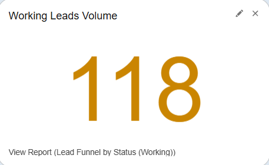
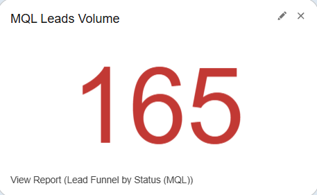
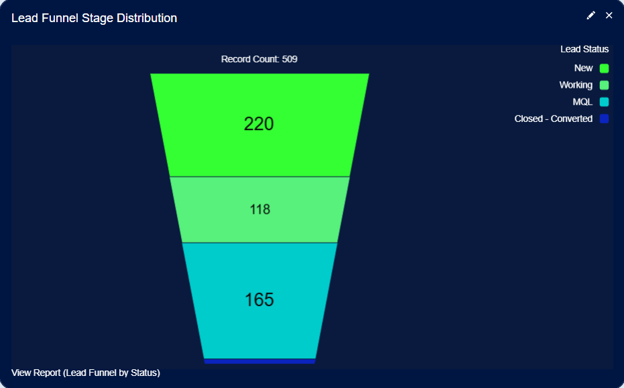
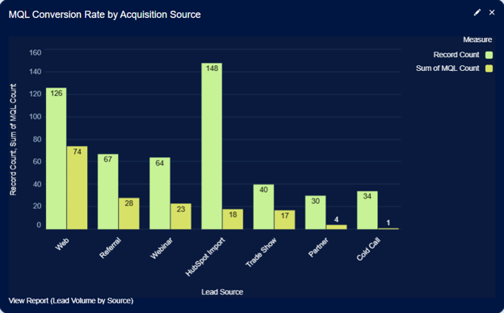

# Lead Funnel — Qualification & Scoring Dashboard Narrative

> **Author:** Alexander Marvin  
> **Date:** June 2026  
> **Tool:** Salesforce Lightning (Developer Edition)  
> **Data:** Lead lifecycle, qualification, scoring, source attribution, territory, and SDR performance data (sample data)  
> **Purpose:** Demonstrate lead lifecycle visibility, qualification effectiveness, lead scoring validation, acquisition source quality, and territory-level performance management through a unified funnel analytics framework.

---

## Executive Summary

This dashboard serves as a lead qualification intelligence hub, providing complete visibility into the lead lifecycle from initial acquisition through conversion. By combining funnel progression metrics, lead quality scoring, acquisition source analysis, and territory-level performance reporting, the dashboard enables marketing operations and sales development teams to identify conversion bottlenecks, optimize qualification processes, and improve overall sales readiness. Leadership can quickly determine where leads are progressing successfully, where they are stalling, and which channels and regions consistently generate the highest-quality opportunities.

---

## 🔑 Strategic Insights Summary

1. Lead lifecycle visibility and funnel progression highlight conversion bottlenecks across the qualification process

**Business Impact:** Teams gain end-to-end visibility into how leads move through each stage of the funnel, making it possible to pinpoint exactly where drop-off occurs and where qualification efficiency breaks down  
**Recommended Action:** Focus on improving stage-to-stage conversion rates by investigating bottlenecks and implementing targeted process improvements in underperforming stages

---

2. Lead scoring and qualification frameworks can be validated against real conversion outcomes

**Business Impact:** Organizations can assess whether lead scoring models accurately reflect sales readiness and identify gaps between theoretical qualification and actual conversion behavior  
**Recommended Action:** Continuously refine scoring rules based on conversion performance and adjust qualification criteria to better align with high-converting lead attributes

---

3. Lead quality distribution and acquisition source performance provide a unified view of inbound demand effectiveness

**Business Impact:** Marketing and revenue teams can evaluate both the quality of incoming leads and the channels generating them, ensuring acquisition strategy is driven by qualification outcomes rather than volume alone  
**Recommended Action:** Increase investment in high-performing acquisition sources while improving or eliminating channels that consistently produce low-quality or low-converting leads

---

4. Territory performance and SDR execution metrics reveal regional and operational imbalances in qualification output

**Business Impact:** Leadership can identify disparities in MQL generation and SDR performance across territories, enabling more balanced resource allocation and improved coverage consistency  
**Recommended Action:** Rebalance territory assignments where necessary and apply coaching or enablement support to underperforming SDR teams or regions

---

5. Funnel health reporting enables shared visibility across marketing, sales development, and revenue operations

**Business Impact:** Cross-functional teams operate from a unified understanding of lead quality, funnel health, and conversion performance, improving alignment across the entire revenue engine  
**Recommended Action:** Use funnel metrics as a standard framework for weekly pipeline reviews, forecasting discussions, and ongoing process optimization initiatives

---

## 📊 Dashboard Walkthrough

### ROW 1: Funnel KPIs

#### New Leads (Metric)

| KPI | Value |
|------|------|
| New Leads | Record Count |

**Key Takeaway:**  
Provides visibility into the volume of newly acquired leads entering the qualification process. This metric serves as the starting point for evaluating funnel health and lead progression.

**Recommended Action:**
- Monitor lead acquisition volume over time.
- Compare incoming lead volume against qualification capacity.
- Investigate significant fluctuations in lead intake.

---

#### Working Leads (Metric)

| KPI | Value |
|------|------|
| Working Leads | Record Count |

**Key Takeaway:**  
Measures the number of leads actively being worked by sales development teams before qualification is completed.

**Recommended Action:**
- Monitor workload distribution across teams.
- Identify potential bottlenecks in lead follow-up activities.
- Ensure leads are progressing through the qualification process efficiently.

---

#### MQL Leads (Metric)

| KPI | Value |
|------|------|
| MQL Leads | Record Count |

**Key Takeaway:**  
Displays the number of leads that have met marketing qualification criteria and are considered sales-ready.

**Recommended Action:**
- Track trends in qualified lead generation.
- Evaluate the effectiveness of qualification criteria.
- Monitor the relationship between lead volume and lead quality.

---

#### Converted Leads (Metric)

| KPI | Value |
|------|------|
| Converted Leads | Record Count |

**Key Takeaway:**  
Measures the volume of leads that successfully progressed through the lifecycle and were converted.

**Recommended Action:**
- Monitor overall conversion performance.
- Compare conversion volume against qualification activity.
- Identify opportunities to improve lifecycle progression.

---

### ROW 2: Qualification Analysis

#### Funnel Breakdown (Funnel Chart)

| Dimension | Measure |
|------------|---------|
| Lead Status | Record Count |

**Key Takeaway:**  
Visualizes lead distribution across lifecycle stages, making it easier to identify where leads are progressing successfully and where attrition occurs.

**Recommended Action:**
- Identify stages with the highest lead loss.
- Investigate qualification bottlenecks.
- Implement process improvements to increase progression rates.

---

#### Lead Score Distribution (Bar Chart)

| Dimension | Measure |
|------------|---------|
| Score Band | Record Count |

**Key Takeaway:**  
Displays how leads are distributed across scoring categories, providing visibility into overall lead quality and scoring model effectiveness.

**Recommended Action:**
- Monitor the proportion of high-scoring leads.
- Evaluate whether scoring criteria align with qualification goals.
- Adjust targeting strategies to improve lead quality.

---

### ROW 3: Source Quality

#### MQL Conversion by Source (Bar Chart)

| Dimension | Measure |
|------------|---------|
| Lead Source | MQL Conversion Rate |

**Key Takeaway:**  
Compares qualification performance across acquisition sources to identify which channels generate the highest percentage of qualified leads.

**Recommended Action:**
- Prioritize investment in high-performing acquisition sources.
- Evaluate lower-performing channels for optimization opportunities.
- Use qualification performance to guide marketing strategy.

---

#### MQL Leads by Territory (Bar Chart)

| Dimension | Measure |
|------------|---------|
| Territory | MQL Lead Volume |

**Key Takeaway:**  
Highlights the distribution of qualified leads across territories, providing visibility into regional performance and pipeline coverage.

**Recommended Action:**
- Compare qualified lead generation across territories.
- Identify regions with lower qualification performance.
- Adjust resource allocation to improve territory coverage.
