# Executive Revenue Intelligence Dashboard — Dashboard Narrative

> **Author:** Alexander Marvin  
> **Date:** June 2026  
> **Tool:** Salesforce Lightning (Developer Edition)  
> **Data:** Campaign performance, marketing attribution, revenue outcomes, customer segmentation, lead quality scoring, territory coverage, and sales pipeline data (sample data)  
> **Purpose:** Demonstrate executive-level revenue intelligence by connecting campaign ROI, attribution performance, customer segmentation, lead quality validation, and territory execution into a unified revenue reporting framework.

---

## Executive Summary

This dashboard serves as an executive revenue intelligence hub, connecting marketing investment, attribution performance, customer segmentation, lead quality validation, and territory execution into a single view. It enables leadership teams to identify which channels, campaigns, customer segments, and territories generate the greatest revenue impact, helping guide investment decisions and growth strategy.

---

## 🔑 Strategic Insights Summary

1. Revenue attribution is fully visible across channels, sources, mediums, and campaigns

**Business Impact:** Marketing contribution can be measured using revenue rather than lead volume alone  
**Recommended Action:** Increase investment in acquisition sources demonstrating the strongest revenue contribution

2. Campaign ROI can be evaluated against actual Closed Won revenue

**Business Impact:** Budget decisions become data-driven rather than assumption-driven  
**Recommended Action:** Expand investment in campaigns producing the highest revenue-to-cost ratios

3. Industry and company-size segmentation reveal the highest-value customer profiles

**Business Impact:** Leadership can identify which market segments generate the greatest revenue potential  
**Recommended Action:** Prioritize demand generation efforts around top-performing customer segments

4. Lead scoring models can be validated against actual revenue outcomes

**Business Impact:** Qualification frameworks can be measured using real business results  
**Recommended Action:** Refine scoring criteria based on attributes most strongly associated with Closed Won revenue

5. UTM source and medium analysis highlights the most effective acquisition strategies

**Business Impact:** Marketing teams gain visibility into which channels influence purchasing behavior  
**Recommended Action:** Optimize channel mix based on revenue contribution rather than engagement metrics

6. Territory-level MQL performance reveals pipeline coverage strengths and weaknesses

**Business Impact:** Leadership can identify resource allocation opportunities across sales territories  
**Recommended Action:** Rebalance territory coverage and staffing where qualified pipeline generation lags

7. Funnel progression reporting exposes lifecycle bottlenecks

**Business Impact:** Delays in qualification and conversion become visible before they impact revenue targets  
**Recommended Action:** Investigate stages with the highest concentration of stalled leads and implement process improvements

8. Marketing, sales, finance, and executive teams operate from a shared revenue framework

**Business Impact:** Eliminates conflicting performance narratives across departments  
**Recommended Action:** Use dashboard KPIs as a common foundation for planning, forecasting, and investment decisions

---

## 📊 Dashboard Walkthrough

### ROW 1: Revenue Performance

#### Closed Won Revenue (Metric)

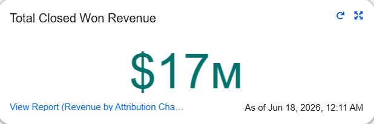

| KPI | Value |
|------|------|
| Total Closed Won Revenue | Sum of Closed Won Opportunity Amount |

**Key Takeaway:**  
Provides an executive-level measure of total revenue generated from successfully closed opportunities. This metric serves as the foundation for evaluating attribution performance, campaign effectiveness, customer segmentation, and lead quality.

**Recommended Action:**
- Monitor overall revenue performance against targets.
- Compare revenue trends across reporting periods.
- Use as the benchmark for evaluating marketing and sales effectiveness.

---

#### Campaign ROI Analysis (Scatterplot)

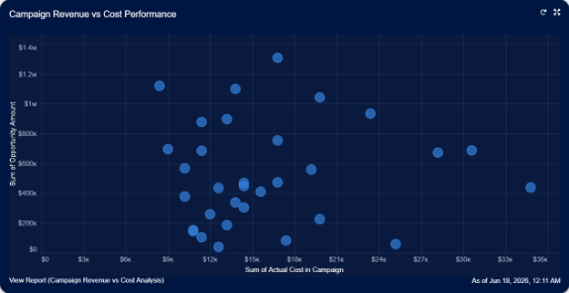

| Metric | Comparison |
|----------|------------|
| Campaign Revenue | Campaign Cost |

**Key Takeaway:**  
Visualizes the relationship between campaign investment and revenue generated, helping identify campaigns that produce the strongest return relative to cost.

**Recommended Action:**
- Increase investment in high-performing campaigns.
- Review campaigns with high cost but low revenue contribution.
- Use ROI performance to guide future budget allocation.

---

#### Revenue by Attribution Channel (Donut)

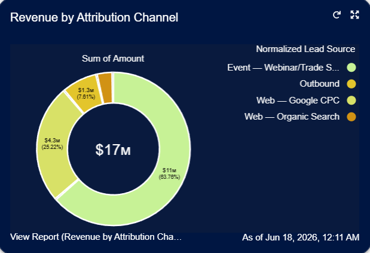

| Dimension | Measure |
|------------|---------|
| Marketing Channel | Revenue Contribution |

**Key Takeaway:**  
Highlights which acquisition channels contribute the largest share of Closed Won revenue.

**Recommended Action:**
- Prioritize channels with the strongest revenue contribution.
- Reevaluate underperforming acquisition channels.
- Align marketing strategy with top-performing sources.

---

### ROW 2: Attribution Intelligence

---

#### Revenue by UTM Medium (Vertical Bar)

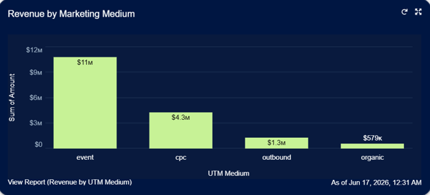

| Dimension | Measure |
|------------|---------|
| UTM Medium | Revenue |

**Key Takeaway:**  
Provides visibility into which marketing mediums produce the strongest revenue outcomes.

**Recommended Action:**
- Allocate budget toward the most effective mediums.
- Evaluate performance differences across marketing channels.
- Refine channel strategy based on revenue contribution.

---

#### Revenue by UTM Campaign (Horizontal Bar)

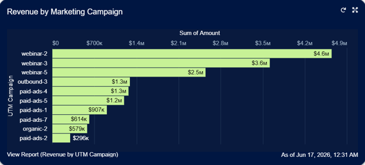

| Dimension | Measure |
|------------|---------|
| UTM Campaign | Revenue |

**Key Takeaway:**  
Ranks marketing campaigns by revenue contribution, helping leadership identify the initiatives generating the greatest business impact.

**Recommended Action:**
- Replicate characteristics of top-performing campaigns.
- Review low-performing campaigns for optimization opportunities.
- Use campaign revenue performance to guide planning decisions.

---

### ROW 3: Customer & ICP Analytics

#### Revenue by Industry (Horizontal Bar)

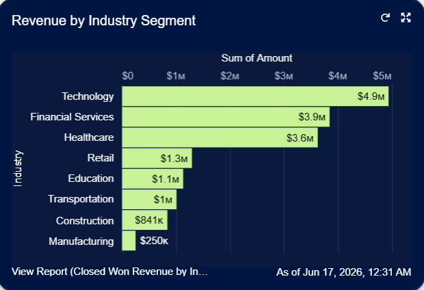

| Dimension | Measure |
|------------|---------|
| Industry | Revenue |

**Key Takeaway:**  
Shows which industries generate the highest revenue contribution and represent the strongest market opportunities.

**Recommended Action:**
- Prioritize high-performing industries in demand generation efforts.
- Develop industry-specific marketing strategies.
- Evaluate resource allocation across vertical markets.

---

#### ICP Revenue Analysis (Stacked Bar)

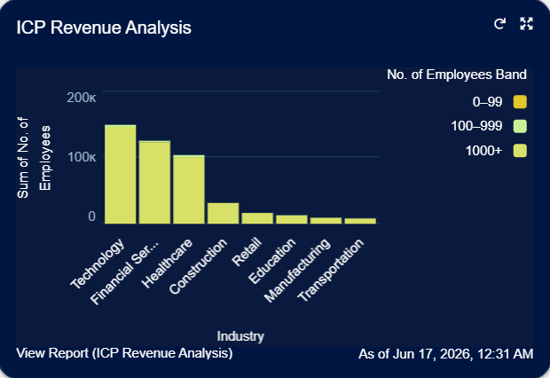

| Dimensions | Measure |
|------------|---------|
| Industry × Company Size | Revenue |

**Key Takeaway:**  
Provides visibility into which combinations of industry and company size generate the highest-value customer profiles.

**Recommended Action:**
- Refine Ideal Customer Profile targeting.
- Increase focus on high-value customer segments.
- Align marketing and sales strategies around top-performing profiles.

---

#### Revenue by Company Size (Horizontal Bar)

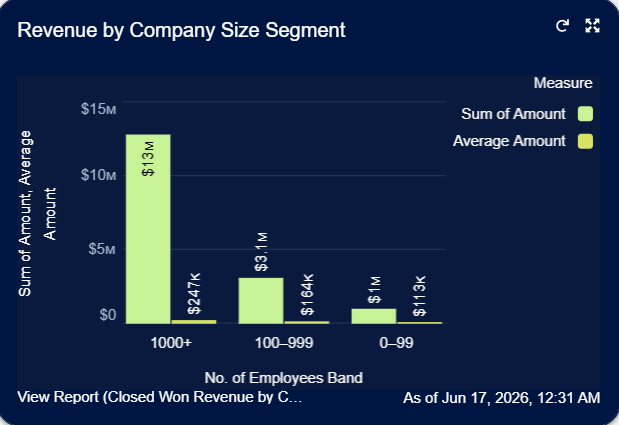

| Dimension | Measure |
|------------|---------|
| Company Size Band | Revenue & Average Revenue |

**Key Takeaway:**  
Identifies which company size segments contribute the greatest revenue and average deal value.

**Recommended Action:**
- Prioritize company size segments with strong revenue performance.
- Evaluate acquisition strategies by customer segment.
- Align targeting efforts with highest-value accounts.

---

### ROW 4: Lead Quality & Scoring Validation

#### Lead Score Distribution (Vertical Bar)

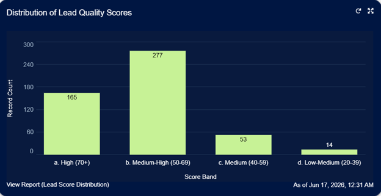

| Dimension | Measure |
|------------|---------|
| Score Band | Lead Count |

**Key Takeaway:**  
Provides visibility into the distribution of lead quality across the database and qualification framework.

**Recommended Action:**
- Monitor lead quality trends over time.
- Review scoring criteria for balance and accuracy.
- Ensure sufficient volume of highly qualified leads enters the funnel.

---

#### Lead Attribute Impact on Closed Won Revenue (Stacked Bar)

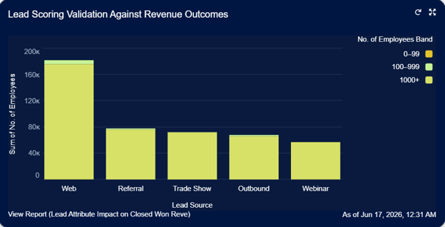

| Dimensions | Measure |
|------------|---------|
| Lead Source × Company Size | Revenue |

**Key Takeaway:**  
Validates whether lead scoring assumptions align with actual revenue outcomes by comparing lead attributes against Closed Won revenue.

**Recommended Action:**
- Refine lead scoring models based on revenue performance.
- Prioritize lead attributes associated with high-value customers.
- Continuously validate qualification frameworks against business results.

---

### ROW 5: Territory & Pipeline Execution

#### MQL Leads by Territory & SDR (Dual Measure Bar)

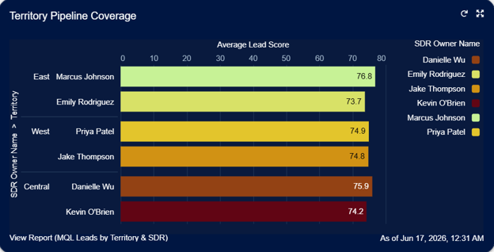

| Measures | Dimensions |
|-----------|------------|
| MQL Count & Average Lead Score | Territory |

**Key Takeaway:**  
Evaluates territory-level pipeline coverage by comparing qualified lead volume and average lead quality across territories.

**Recommended Action:**
- Balance territory workloads where necessary.
- Identify territories generating high-quality pipeline.
- Optimize SDR resource allocation using MQL performance metrics.

---

#### Lead Funnel by Status (Funnel)

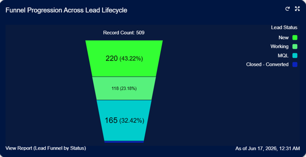

| Dimension | Measure |
|------------|---------|
| Lead Status | Record Count |

**Key Takeaway:**  
Illustrates lead progression through the lifecycle and highlights potential funnel bottlenecks.

**Recommended Action:**
- Investigate stages with significant drop-off.
- Improve qualification and follow-up processes.
- Monitor lifecycle conversion trends regularly.

---


```python

```


```python

```
