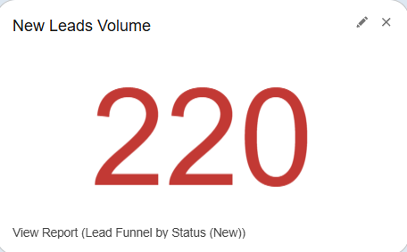
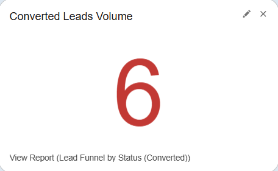
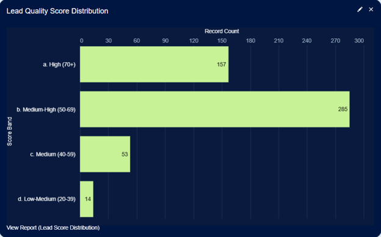
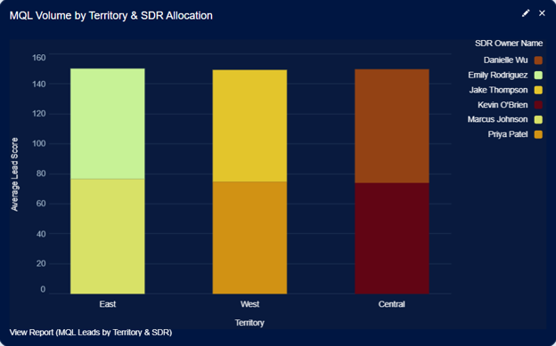

# Lead Funnel — Qualification & Scoring Dashboard Narrative

> **Author:** Alexander Marvin  
> **Date:** June 2026  
> **Tool:** Salesforce Lightning (Developer Edition)  
> **Data:** Lead lifecycle, qualification, scoring, source attribution, territory, and SDR performance data (sample data)  
> **Purpose:** Demonstrate lead lifecycle visibility, qualification effectiveness, lead scoring validation, acquisition source quality, and territory-level performance management through a unified funnel analytics framework.

---

## Executive Summary

This dashboard serves as a lead qualification intelligence hub, providing complete visibility into the lead lifecycle from initial acquisition through conversion. By combining funnel progression metrics, lead quality scoring, acquisition source analysis, and territory-level performance reporting, the dashboard enables marketing operations and sales development teams to identify conversion bottlenecks, optimize qualification processes, and improve overall sales readiness. Leadership can quickly determine where leads are progressing successfully, where they are stalling, and which channels and regions consistently generate the highest-quality opportunities.

---

## 🔑 Strategic Insights Summary

1. Full lead lifecycle progression is visible across every qualification stage

**Business Impact:** Teams can identify exactly where leads drop out of the funnel and prioritize corrective action  
**Recommended Action:** Investigate stages with the largest conversion losses and implement targeted process improvements

2. Lead scoring models can be validated against actual qualification outcomes

**Business Impact:** Organizations can determine whether scoring frameworks accurately distinguish high-value prospects from lower-priority leads  
**Recommended Action:** Refine scoring rules based on characteristics most commonly associated with successful conversions

3. Lead quality distribution provides visibility into overall pipeline health

**Business Impact:** Leadership gains insight into whether marketing efforts are generating sufficient volumes of qualified prospects  
**Recommended Action:** Adjust targeting strategies and campaign segmentation to increase the proportion of high-scoring leads

4. Acquisition source analysis reveals which channels generate the highest MQL conversion rates

**Business Impact:** Marketing teams can evaluate channel effectiveness based on lead quality rather than volume alone  
**Recommended Action:** Increase investment in sources consistently producing high-performing qualified leads

5. Territory-level MQL reporting highlights regional performance differences

**Business Impact:** Resource allocation decisions can be guided by measurable differences in qualified lead generation across territories  
**Recommended Action:** Rebalance territory coverage and support where MQL production falls below expectations

6. SDR performance visibility supports operational coaching and workload management

**Business Impact:** Sales development leadership can identify top-performing teams and areas requiring additional support  
**Recommended Action:** Share best practices from high-performing SDRs and address process gaps impacting qualification outcomes

7. Funnel health reporting provides early warning of qualification inefficiencies

**Business Impact:** Organizations can identify process bottlenecks before they significantly impact pipeline quality and conversion performance  
**Recommended Action:** Monitor stage progression trends and address recurring qualification delays

8. Marketing, sales development, and revenue operations teams operate from a shared qualification framework

**Business Impact:** Cross-functional teams gain a common understanding of funnel health, lead quality, and conversion performance  
**Recommended Action:** Use dashboard metrics as a standardized foundation for lead management reviews, forecasting discussions, and process optimization initiatives

---

## 📊 Dashboard Walkthrough

### ROW 1: Funnel KPIs

#### New Leads (Metric)

| KPI | Value |
|------|------|
| New Leads | Record Count |

**Key Takeaway:**  
Provides visibility into the volume of newly acquired leads entering the qualification process. This metric serves as the starting point for evaluating funnel health and lead progression.

**Recommended Action:**
- Monitor lead acquisition volume over time.
- Compare incoming lead volume against qualification capacity.
- Investigate significant fluctuations in lead intake.

---

#### Working Leads (Metric)

| KPI | Value |
|------|------|
| Working Leads | Record Count |

**Key Takeaway:**  
Measures the number of leads actively being worked by sales development teams before qualification is completed.

**Recommended Action:**
- Monitor workload distribution across teams.
- Identify potential bottlenecks in lead follow-up activities.
- Ensure leads are progressing through the qualification process efficiently.

---

#### MQL Leads (Metric)

| KPI | Value |
|------|------|
| MQL Leads | Record Count |

**Key Takeaway:**  
Displays the number of leads that have met marketing qualification criteria and are considered sales-ready.

**Recommended Action:**
- Track trends in qualified lead generation.
- Evaluate the effectiveness of qualification criteria.
- Monitor the relationship between lead volume and lead quality.

---

#### Converted Leads (Metric)

| KPI | Value |
|------|------|
| Converted Leads | Record Count |

**Key Takeaway:**  
Measures the volume of leads that successfully progressed through the lifecycle and were converted.

**Recommended Action:**
- Monitor overall conversion performance.
- Compare conversion volume against qualification activity.
- Identify opportunities to improve lifecycle progression.

---

### ROW 2: Qualification Analysis

#### Funnel Breakdown (Funnel Chart)

| Dimension | Measure |
|------------|---------|
| Lead Status | Record Count |

**Key Takeaway:**  
Visualizes lead distribution across lifecycle stages, making it easier to identify where leads are progressing successfully and where attrition occurs.

**Recommended Action:**
- Identify stages with the highest lead loss.
- Investigate qualification bottlenecks.
- Implement process improvements to increase progression rates.

---

#### Lead Score Distribution (Bar Chart)

| Dimension | Measure |
|------------|---------|
| Score Band | Record Count |

**Key Takeaway:**  
Displays how leads are distributed across scoring categories, providing visibility into overall lead quality and scoring model effectiveness.

**Recommended Action:**
- Monitor the proportion of high-scoring leads.
- Evaluate whether scoring criteria align with qualification goals.
- Adjust targeting strategies to improve lead quality.

---

### ROW 3: Source Quality

#### MQL Conversion by Source (Bar Chart)

| Dimension | Measure |
|------------|---------|
| Lead Source | MQL Conversion Rate |

**Key Takeaway:**  
Compares qualification performance across acquisition sources to identify which channels generate the highest percentage of qualified leads.

**Recommended Action:**
- Prioritize investment in high-performing acquisition sources.
- Evaluate lower-performing channels for optimization opportunities.
- Use qualification performance to guide marketing strategy.

---

#### MQL Leads by Territory (Bar Chart)

| Dimension | Measure |
|------------|---------|
| Territory | MQL Lead Volume |

**Key Takeaway:**  
Highlights the distribution of qualified leads across territories, providing visibility into regional performance and pipeline coverage.

**Recommended Action:**
- Compare qualified lead generation across territories.
- Identify regions with lower qualification performance.
- Adjust resource allocation to improve territory coverage.
