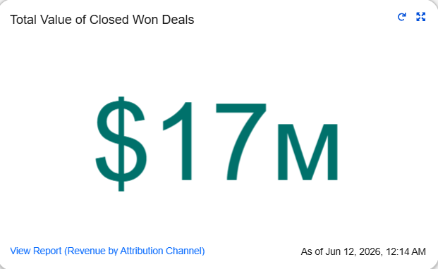
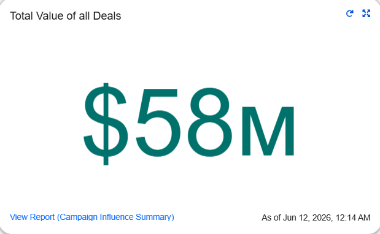
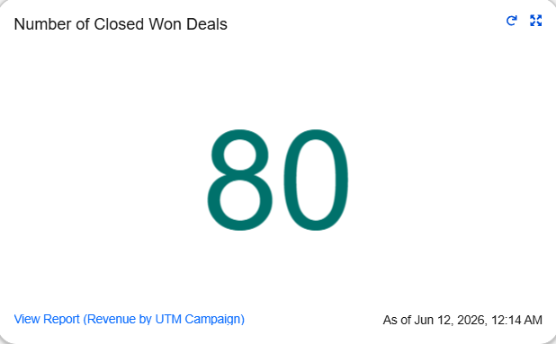
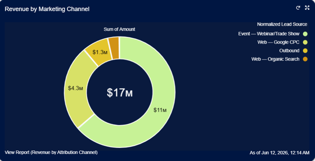
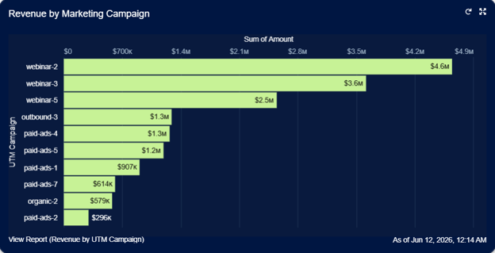
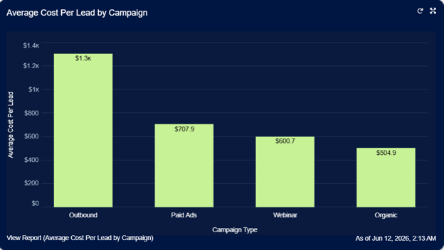
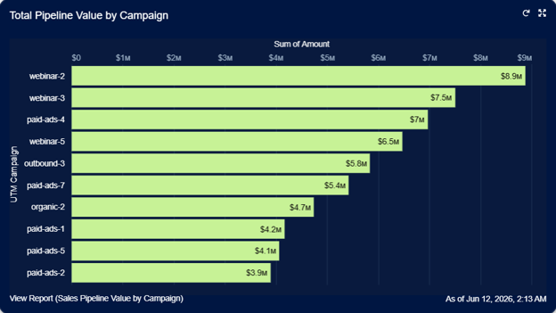

# Marketing ROI — Campaign Performance Dashboard Narrative

> **Author:** Alexander Marvin  
> **Date:** June 2026  
> **Tool:** Salesforce Lightning (Developer Edition)  
> **Data:** Marketing campaign performance, revenue attribution, campaign influence, opportunity pipeline, acquisition channels, campaign costs, and ROI metrics (sample data)  
> **Purpose:** Demonstrate marketing performance measurement, campaign ROI analysis, revenue attribution visibility, pipeline influence tracking, and cost-efficiency optimization through a unified marketing analytics framework.

---

## Executive Summary

This dashboard serves as a marketing revenue intelligence hub, providing complete visibility into the relationship between marketing investment and revenue generation. By combining campaign performance metrics, revenue attribution reporting, influenced pipeline analysis, and acquisition cost measurements, the dashboard enables marketing operations, demand generation, and revenue leadership teams to evaluate campaign effectiveness across the entire customer acquisition lifecycle. Leadership can quickly identify which channels and campaigns generate the greatest revenue impact, which initiatives produce the strongest pipeline contribution, and where marketing investments deliver the highest return on investment.

---

## 🔑 Strategic Insights Summary

1. Marketing performance is measured from initial acquisition through revenue generation

**Business Impact:** Organizations gain full visibility into how marketing investments contribute to pipeline creation and closed revenue outcomes  
**Recommended Action:** Use end-to-end attribution reporting to evaluate campaign effectiveness across the complete buyer journey

2. Revenue attribution analysis identifies the highest-performing acquisition channels

**Business Impact:** Marketing leaders can determine which channels consistently generate the greatest revenue contribution  
**Recommended Action:** Increase investment in channels with strong revenue performance while reassessing underperforming acquisition sources

3. Campaign-level revenue reporting highlights the initiatives driving business growth

**Business Impact:** Teams can identify which campaigns contribute the most value beyond lead volume alone  
**Recommended Action:** Replicate successful campaign strategies and allocate future budget toward proven revenue-generating programs

4. Influenced pipeline visibility demonstrates marketing's contribution to future revenue

**Business Impact:** Revenue teams gain insight into the volume and value of opportunities associated with marketing activities  
**Recommended Action:** Monitor influenced pipeline trends to improve forecasting accuracy and evaluate long-term marketing impact

5. Marketing-sourced opportunity reporting strengthens attribution accountability

**Business Impact:** Leadership can quantify the direct contribution of marketing efforts to closed business outcomes  
**Recommended Action:** Establish performance benchmarks for marketing-sourced opportunities and track progress against revenue goals

6. Cost per lead analysis reveals campaign acquisition efficiency

**Business Impact:** Marketing teams can evaluate whether campaigns are generating leads at sustainable acquisition costs  
**Recommended Action:** Optimize targeting, messaging, and channel selection to reduce acquisition expenses while maintaining lead quality

7. Cost per opportunity metrics provide deeper ROI validation

**Business Impact:** Organizations can assess campaign performance based on qualified sales outcomes rather than lead volume alone  
**Recommended Action:** Prioritize campaigns that consistently generate opportunities at lower costs while maintaining conversion quality

8. Marketing, sales, and revenue operations teams operate from a shared ROI framework

**Business Impact:** Cross-functional stakeholders gain a unified view of marketing contribution, revenue impact, and investment efficiency  
**Recommended Action:** Use dashboard metrics as a standardized foundation for budget planning, campaign reviews, forecasting discussions, and strategic growth initiatives

---

## 📊 Dashboard Walkthrough

### ROW 1: Executive KPIs

#### Closed Won Revenue (Metric)

| KPI | Value |
|------|------|
| Closed Won Revenue | Sum of Amount |

**Key Takeaway:**  
Provides visibility into the total revenue generated from Closed Won opportunities attributed to marketing efforts.

**Recommended Action:**
- Monitor overall marketing-attributed revenue performance.
- Compare revenue generation against marketing investment levels.
- Identify trends in revenue growth over time.

---

#### Influenced Pipeline (Metric)

| KPI | Value |
|------|------|
| Influenced Pipeline | Sum of Opportunity Value |

**Key Takeaway:**  
Measures the total pipeline value associated with marketing campaign influence across active opportunities.

**Recommended Action:**
- Track marketing contribution to future revenue opportunities.
- Monitor pipeline growth generated through campaign activity.
- Evaluate pipeline coverage relative to revenue targets.

---

#### Marketing-Sourced Opportunities (Metric)

| KPI | Value |
|------|------|
| Marketing-Sourced Opportunities | Record Count |

**Key Takeaway:**  
Displays the number of Closed Won opportunities directly associated with marketing campaigns.

**Recommended Action:**
- Monitor the volume of opportunities generated by marketing efforts.
- Compare opportunity creation trends across reporting periods.
- Evaluate marketing contribution to overall sales outcomes.

---

### ROW 2: Revenue Attribution

#### Revenue by Attribution Channel (Donut Chart)

| Visualization | Grouping |
|------|------|
| Donut Chart | Attribution Channel |

**Key Takeaway:**  
Breaks down Closed Won revenue by acquisition channel to highlight the sources generating the greatest revenue contribution.

**Recommended Action:**
- Identify the highest-performing acquisition channels.
- Evaluate revenue concentration across channels.
- Adjust channel investment based on revenue contribution.

---

#### Revenue by UTM Campaign (Horizontal Bar Chart)

| Visualization | Grouping |
|------|------|
| Horizontal Bar Chart | UTM Campaign |

**Key Takeaway:**  
Compares revenue performance across marketing campaigns to identify initiatives generating the greatest business impact.

**Recommended Action:**
- Identify top-performing campaigns.
- Analyze characteristics of successful campaign strategies.
- Prioritize future investment in high-performing campaigns.

---

### ROW 3: Marketing ROI

#### Cost Per Lead (Bar Chart)

| Visualization | Metric |
|------|------|
| Bar Chart | Average Cost Per Lead |

**Key Takeaway:**  
Measures the average acquisition cost required to generate a lead for each marketing campaign.

**Recommended Action:**
- Monitor lead acquisition efficiency across campaigns.
- Identify campaigns with lower acquisition costs.
- Optimize campaign spending to improve efficiency.

---

#### Pipeline Value (Horizontal Bar Chart)

| Visualization | Grouping |
|------|------|
| Horizontal Bar Chart | UTM Campaign |

**Key Takeaway:**  
Displays total pipeline value generated by individual marketing campaigns.

**Recommended Action:**
- Compare pipeline generation performance across campaigns.
- Monitor campaign contribution to future revenue opportunities.
- Prioritize campaigns generating strong pipeline value.

---
